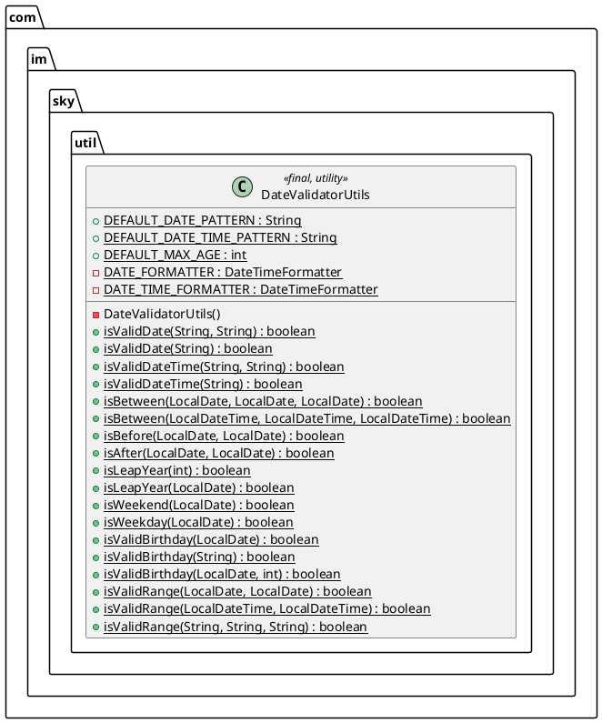

# Design Document

## 1. Technical Architecture

### 1.1 Technology Selection

- **Language / JDK**: Java 8+（项目现有版本）
- **Date / Time API**: `java.time` 包（`LocalDate`、`LocalDateTime`、`DateTimeFormatter`、`Period`）
- **禁用 API**: `java.util.Date`、`java.util.Calendar`、`SimpleDateFormat`（线程不安全且已被 java.time 取代）
- **测试框架**: JUnit 4（与项目 `pom.xml` 现有依赖保持一致；若不存在则使用 `main` 方法自验证）
- **目标包路径**: `com.im.sky.util`
- **目标文件**:
  - `src/main/java/com/im/sky/util/DateValidatorUtils.java`（工具类）
  - `src/test/java/com/im/sky/util/DateValidatorUtilsTest.java`（测试类）

### 1.2 System Architecture



**核心模块说明：**
- **格式校验模块**：`isValidDate` / `isValidDateTime`，负责字符串与日期格式 + 真实性校验
- **范围比较模块**：`isBetween` / `isBefore` / `isAfter`，处理日期相对位置判断
- **日历语义模块**：`isLeapYear` / `isWeekend` / `isWeekday`，提供日历语义判断
- **业务语义模块**：`isValidBirthday`，封装出生日期常见业务规则
- **区间合法性模块**：`isValidRange`，校验起止日期合法性

### 1.3 Technical Dependencies

- 仅依赖 JDK 内置 `java.time`、`java.util.Objects`，无第三方依赖
- 与项目现有 `BigDecimalUtils`、`SecureRandomUtils` 保持一致的工具类风格

## 2. Detailed Design

### 2.1 Backend Design

#### 2.1.1 常量与构造

| 常量名 | 类型 | 默认值 | 说明 |
| --- | --- | --- | --- |
| `DEFAULT_DATE_PATTERN` | `String` | `"yyyy-MM-dd"` | 默认日期格式 |
| `DEFAULT_DATE_TIME_PATTERN` | `String` | `"yyyy-MM-dd HH:mm:ss"` | 默认日期时间格式 |
| `DEFAULT_MAX_AGE` | `int` | `150` | 出生日期校验最大年龄 |
| `DATE_FORMATTER` | `DateTimeFormatter` | `ofPattern(DEFAULT_DATE_PATTERN)` | 默认日期 formatter（缓存） |
| `DATE_TIME_FORMATTER` | `DateTimeFormatter` | `ofPattern(DEFAULT_DATE_TIME_PATTERN)` | 默认日期时间 formatter（缓存） |

构造方法 `private DateValidatorUtils()`，内部 `throw new UnsupportedOperationException("DateValidatorUtils cannot be instantiated")`。

#### 2.1.2 关键方法签名与行为契约

```java
// 日期字符串校验
public static boolean isValidDate(String dateStr, String pattern);
public static boolean isValidDate(String dateStr);
public static boolean isValidDateTime(String dateTimeStr, String pattern);
public static boolean isValidDateTime(String dateTimeStr);

// 范围比较（LocalDate / LocalDateTime 两套）
public static boolean isBetween(LocalDate date, LocalDate start, LocalDate end);
public static boolean isBetween(LocalDateTime dt, LocalDateTime start, LocalDateTime end);
public static boolean isBefore(LocalDate date, LocalDate target);
public static boolean isAfter(LocalDate date, LocalDate target);

// 日历语义
public static boolean isLeapYear(int year);
public static boolean isLeapYear(LocalDate date);
public static boolean isWeekend(LocalDate date);
public static boolean isWeekday(LocalDate date);

// 出生日期校验
public static boolean isValidBirthday(LocalDate birthday);
public static boolean isValidBirthday(String birthdayStr);
public static boolean isValidBirthday(LocalDate birthday, int maxAge);

// 区间合法性
public static boolean isValidRange(LocalDate start, LocalDate end);
public static boolean isValidRange(LocalDateTime start, LocalDateTime end);
public static boolean isValidRange(String startStr, String endStr, String pattern);
```

**核心算法：**
- **格式校验**：使用 `LocalDate.parse(dateStr, formatter)`，捕获 `DateTimeParseException` 返回 `false`。`DateTimeFormatter` 默认严格解析，不会接受 `2025-02-30`，无需额外判断。
- **空白校验**：使用 `str == null || str.trim().isEmpty()` 判断（兼容 JDK 8，不使用 `isBlank()`）。
- **闰年判断**：`(year % 4 == 0 && year % 100 != 0) || year % 400 == 0`，等价于 `Year.isLeap(year)`。
- **周末判断**：`DayOfWeek dow = date.getDayOfWeek(); return dow == SATURDAY || dow == SUNDAY;`
- **出生日期年龄计算**：`Period.between(birthday, LocalDate.now()).getYears()`。

#### 2.1.3 异常处理策略

| 场景 | 处理方式 |
| --- | --- |
| 入参 `null` 字符串 / `LocalDate` | 返回 `false`（语义：非法输入 = 校验失败） |
| 入参 `pattern` 为 `null` 或空白 | 抛 `IllegalArgumentException`（编码错误，需开发感知） |
| `maxAge <= 0` | 抛 `IllegalArgumentException`（编码错误） |
| `DateTimeParseException`（解析失败） | 捕获并返回 `false`（业务输入错误，不向上扩散） |

#### 2.1.4 线程安全设计

- `DateTimeFormatter` 不可变且线程安全，可作为 `static final` 缓存
- 工具类无成员变量，所有方法为纯函数，天然线程安全
- 自定义 `pattern` 通过 `DateTimeFormatter.ofPattern(pattern)` 即时创建，性能开销可接受（无锁、无同步）

### 2.2 Directory Structure Design

```
promotion/
├── src/
│   ├── main/
│   │   └── java/
│   │       └── com/im/sky/util/
│   │           ├── BigDecimalUtils.java       (existing)
│   │           ├── SecureRandomUtils.java     (existing)
│   │           ├── HttpUtils.java             (existing)
│   │           └── DateValidatorUtils.java    (new)
│   └── test/
│       └── java/
│           └── com/im/sky/util/
│               └── DateValidatorUtilsTest.java (new)
└── .joycode/specs/date-validation-utility/
    ├── requirements.md
    ├── design.md
    └── tasks.md
```

## 3. Quality Assurance

### 3.1 Testing Strategy

- **单元测试**：JUnit 4，每个 public 方法覆盖正常、null、边界、异常 4 类用例
- **关键测试用例**：
  - 格式校验：`2025-02-30` 应为 `false`、`2024-02-29` 应为 `true`、`2025/01/01` 与 `yyyy-MM-dd` 应为 `false`
  - 闰年：2000=true、2100=false、2024=true、2023=false
  - 出生日期：未来日期、刚好 150 岁、151 岁、`null` 等边界
  - 区间：`start > end` 应为 `false`、`null` 边界处理
- **测试文件**：`src/test/java/com/im/sky/util/DateValidatorUtilsTest.java`

### 3.2 性能考量

- 默认 formatter 缓存为 `static final`，避免重复创建开销
- 自定义 pattern 调用频率低，按需创建可接受
- 所有方法 O(1) 时间复杂度

### 3.3 Security & Compliance

- 严禁使用 `SimpleDateFormat`（线程不安全，并发场景下结果错乱）
- 严禁吞掉 `IllegalArgumentException`（编码错误必须暴露）
- JavaDoc 完整，符合阿里 Java 开发手册"工具类强制 final + 私有构造"规范
- 不引入任何第三方依赖，零侵入

### 3.4 监控与告警

- 工具类层级无运行时副作用，无需监控埋点
- 调用方根据自身业务场景自行决定校验失败时的日志/告警策略